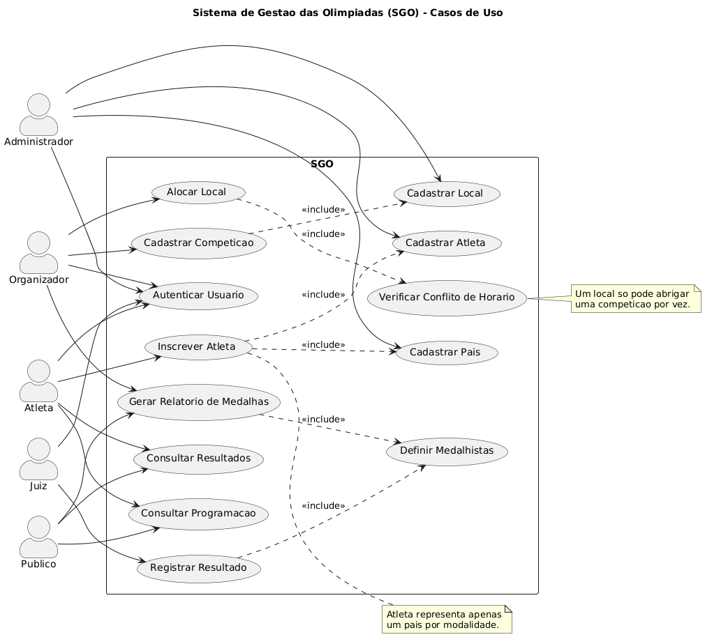
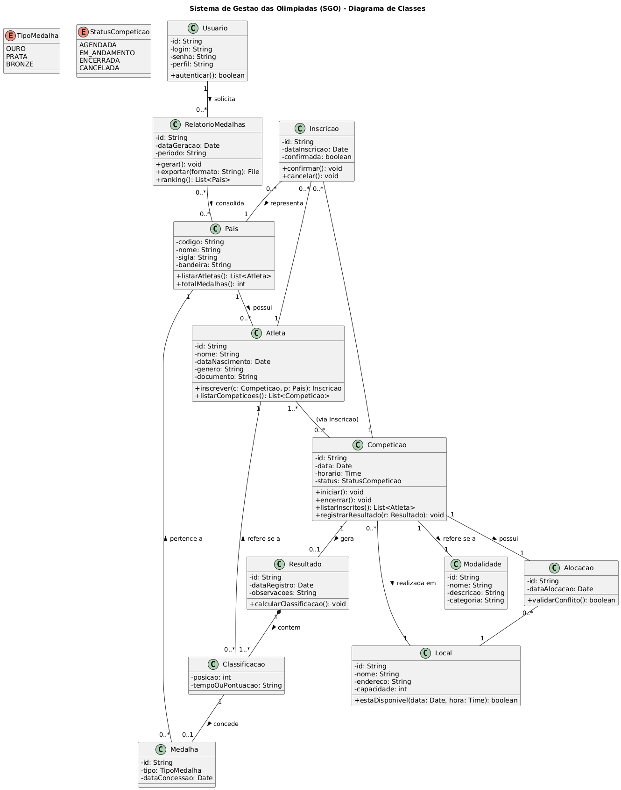
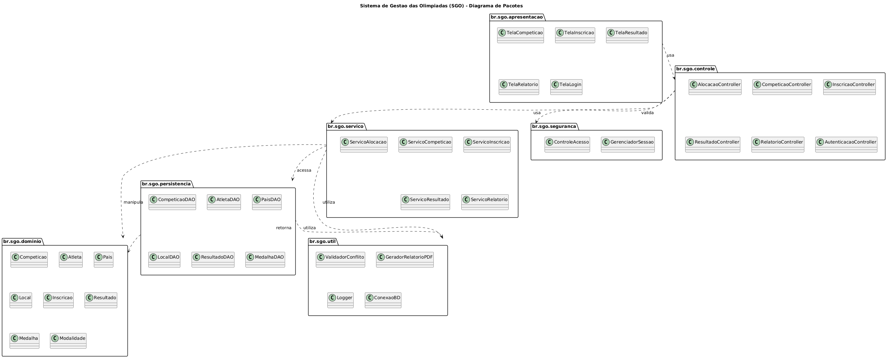
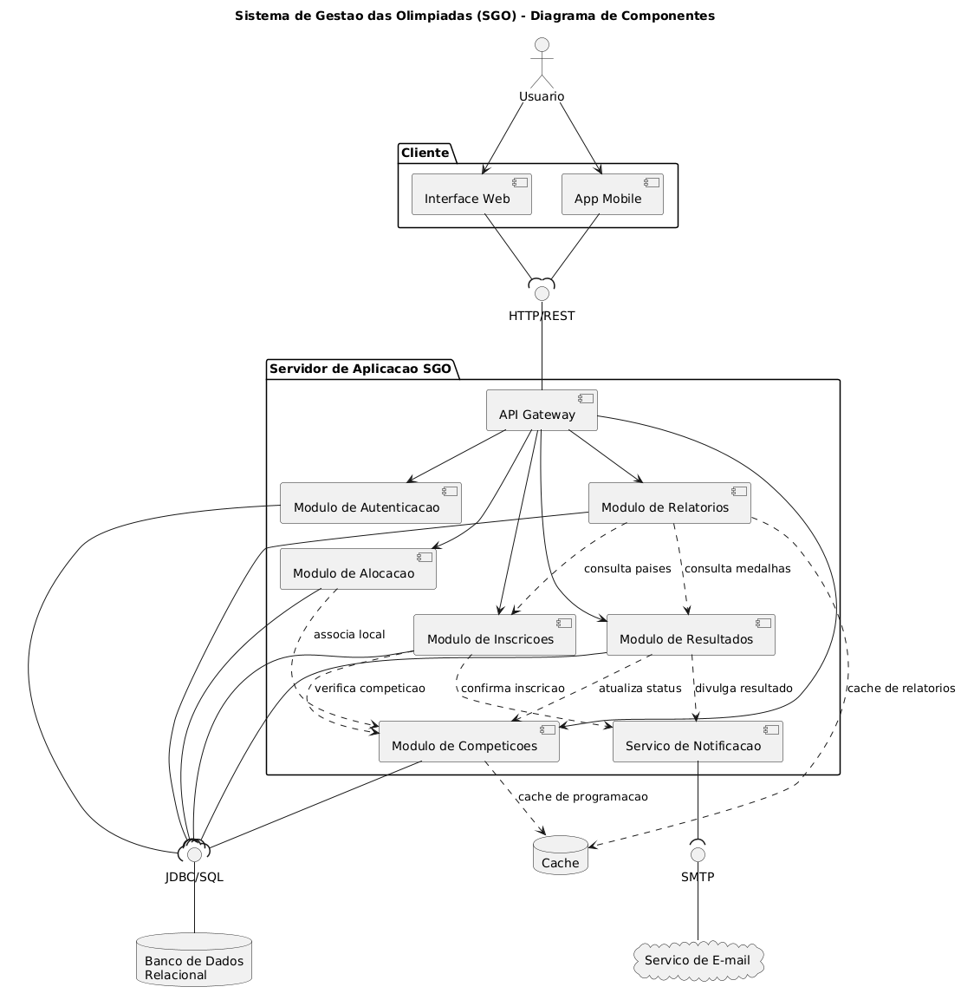

# Sistema de Gestão das Olimpíadas (SGO)

Trabalho 1 — Primeira entrega da disciplina **Projeto de Software**

Curso de Engenharia de Software — PUC Minas


Professor: João Paulo Carneiro Aramuni


Aluno: Gabriel Peçanha Santiago


Este repositório contém a modelagem em **UML** (PlantUML) do **Sistema de Gestão das Olimpíadas (SGO)**, um sistema responsável por coordenar competições, inscrições de atletas, alocação de locais, registro de resultados e geração de relatórios de medalhas.

---

## 📑 Sumário

- [Descrição do Sistema](#-descrição-do-sistema)
- [Regras de Negócio](#-regras-de-negócio)
- [Histórias de Usuário](#-histórias-de-usuário)
- [Diagramas UML](#-diagramas-uml)
- [Diagrama de Caso de Uso](#diagrama-de-caso-de-uso)
- [Diagrama de Classes](#diagrama-de-classes)
- [Diagrama de Pacotes](#diagrama-de-pacotes)
- [Diagrama de Componentes](#diagrama-de-componentes)
- [Diagrama de Implantação](#diagrama-de-implantação)
- [Estrutura do Repositório](#-estrutura-do-repositório)
- [Como Renderizar os Diagramas](#-como-renderizar-os-diagramas)

---

## 📌 Descrição do Sistema

Com a chegada das Olimpíadas, um novo sistema de gestão é necessário para coordenar os diferentes aspectos do evento. O **SGO** permite o gerenciamento de competições, a inscrição de atletas de diferentes países, a alocação de locais para as provas e o controle dos resultados, gerando ao final relatórios de desempenho por país com base nas medalhas conquistadas.

---

## 📋 Regras de Negócio

1. **Cadastro de Competições** — o sistema permite o cadastro de competições contendo nome da modalidade, data, horário, local e lista de atletas inscritos.
2. **Inscrição de Atletas** — atletas de diferentes países se inscrevem em competições específicas. Um atleta pode participar de várias competições, mas só pode representar **um país por modalidade**.
3. **Alocação de Locais** — locais são alocados de forma a evitar conflitos de horário; **um local só pode abrigar uma competição por vez**.
4. **Controle de Resultados** — após a realização das competições, os resultados são registrados determinando o atleta vencedor e os classificados em segundo e terceiro lugares.
5. **Relatórios de Medalhas** — o sistema gera relatórios mostrando o desempenho de cada país com base nas medalhas de ouro, prata e bronze conquistadas.

---

## 👤 Histórias de Usuário

**US01 — Cadastrar competição**
Eu, como **organizador**, quero **cadastrar uma competição** informando modalidade, data, horário e local, para **organizar a agenda dos jogos**.

**US02 — Inscrever atleta em competição**
Eu, como **atleta**, quero **me inscrever em uma competição representando o meu país**, para **participar oficialmente da modalidade**.

**US03 — Restringir representação a um país por modalidade**
Eu, como **organizador**, quero que o sistema **impeça que um mesmo atleta represente mais de um país em uma mesma modalidade**, para **garantir a integridade da competição**.

**US04 — Cadastrar local de prova**
Eu, como **administrador**, quero **cadastrar locais com capacidade e endereço**, para **disponibilizá-los para alocação em competições**.

**US05 — Alocar local sem conflito de horário**
Eu, como **organizador**, quero **alocar um local para uma competição em uma data e horário específicos**, para **evitar que duas competições ocupem o mesmo local ao mesmo tempo**.

**US06 — Registrar resultados de uma competição**
Eu, como **juiz**, quero **registrar o resultado de uma competição informando os classificados em 1º, 2º e 3º lugar**, para **oficializar o desempenho dos atletas**.

**US07 — Atribuir medalhas automaticamente**
Eu, como **organizador**, quero que o sistema **atribua automaticamente as medalhas de ouro, prata e bronze ao registrar o resultado**, para **reduzir trabalho manual e evitar erros**.

**US08 — Consultar programação das competições**
Eu, como **público**, quero **consultar a programação das competições por data, modalidade e local**, para **acompanhar os eventos**.

**US09 — Consultar resultados oficiais**
Eu, como **público**, quero **consultar os resultados oficiais de cada competição**, para **acompanhar o desempenho dos atletas e países**.

**US10 — Gerar relatório de medalhas por país**
Eu, como **organizador**, quero **gerar um relatório com o quadro de medalhas por país (ouro, prata e bronze)**, para **avaliar o desempenho geral de cada nação na Olimpíada**.

**US11 — Cadastrar atleta e seu país**
Eu, como **administrador**, quero **cadastrar atletas e vincular cada um a um país**, para **manter a base oficial de participantes**.

**US12 — Autenticar usuários por perfil**
Eu, como **usuário do sistema**, quero **fazer login com meu perfil (administrador, organizador, juiz ou atleta)**, para **acessar apenas as funcionalidades correspondentes ao meu papel**.

---

## 🧩 Diagramas UML

Todos os diagramas foram modelados em **PlantUML**. Os códigos-fonte (`.puml`) estão na pasta [`codigos/`](./codigos) e as imagens renderizadas (`.png`) na pasta [`imagens/`](./imagens).

### Diagrama de Caso de Uso

Modela os principais casos de uso do sistema — *Cadastrar Competição*, *Inscrever Atleta*, *Alocar Local*, *Registrar Resultado*, *Gerar Relatório de Medalhas* — junto com os atores envolvidos (Administrador, Organizador, Atleta, Juiz e Público) e os relacionamentos de `<<include>>` entre casos de uso.



### Diagrama de Classes

Apresenta a estrutura estática do sistema, com as classes **Competição**, **Atleta**, **País**, **Local**, **Resultado**, **Medalha**, **Modalidade**, **Inscrição**, **Alocação**, **Classificação**, **RelatorioMedalhas** e **Usuário**, seus atributos, métodos, relacionamentos e cardinalidades. A associação entre **Atleta** e **Competição** é mediada pela classe **Inscrição**, que carrega também o **País** que o atleta representa naquela modalidade — o que materializa a regra de negócio nº 2.



### Diagrama de Pacotes

Organiza o sistema em uma arquitetura em camadas, separando responsabilidades em pacotes:

- `br.sgo.apresentacao` — telas e interface gráfica
- `br.sgo.controle` — controladores (orquestram requisições)
- `br.sgo.servico` — regras de negócio
- `br.sgo.dominio` — entidades do domínio
- `br.sgo.persistencia` — acesso a dados (DAOs)
- `br.sgo.seguranca` — autenticação e controle de acesso
- `br.sgo.util` — utilitários (logger, validador de conflito, gerador de PDF, conexão BD)



### Diagrama de Componentes

Mostra os principais componentes de software do sistema — *Interface de Usuário* (Web e Mobile), *API Gateway*, *Módulo de Autenticação*, *Módulo de Competições*, *Módulo de Inscrições*, *Módulo de Alocação*, *Módulo de Resultados*, *Módulo de Relatórios* e *Serviço de Notificação* — com suas interfaces fornecidas/requeridas (HTTP/REST, JDBC/SQL, SMTP) e dependências entre módulos.



### Diagrama de Implantação

Ilustra a arquitetura física do sistema: dispositivos dos usuários (desktop e mobile), servidor web (NGINX), servidor de aplicação (Docker/Linux com todos os módulos), servidor de banco de dados (PostgreSQL), servidor de cache (Redis) e servidor de e-mail (SMTP), indicando os protocolos e portas usados nas comunicações.


---

## 📁 Estrutura do Repositório

```
sistema-gestao-olimpiadas/
├── README.md
├── codigos/
│   ├── diagrama-de-caso-de-uso.puml
│   ├── diagrama-de-classes.puml
│   ├── diagrama-de-pacotes.puml
│   ├── diagrama-de-componentes.puml
│   └── diagrama-de-implantação.puml
└── imagens/
    ├── diagrama-de-caso-de-uso.png
    ├── diagrama-de-classes.png
    ├── diagrama-de-pacotes.png
    ├── diagrama-de-componentes.png
    └── diagrama-de-implantação.png
```

---

## ⚙️ Como Renderizar os Diagramas

Existem três formas de gerar as imagens a partir dos arquivos `.puml`:

### 1. Servidor oficial do PlantUML (online)
Acesse <https://www.plantuml.com/plantuml/uml/>, cole o conteúdo do `.puml` e visualize.

### 2. PlantUML local (linha de comando)
Requer Java e Graphviz instalados:
```bash
java -jar plantuml.jar -tpng -o ../imagens codigos/*.puml
```

### 3. VS Code
Instale a extensão **PlantUML** (jebbs.plantuml) e use `Alt+D` para preview.

### 4. PlantUML API (Python)

<https://github.com/joaopauloaramuni/projeto-de-software/tree/main/PROJETOS/Python/Projeto%20PlantUML%20API>

---

## 🛠️ Tecnologias Utilizadas na Modelagem

- **PlantUML** — linguagem textual para modelagem UML
- **UML 2** — padrão de modelagem
- **Graphviz** — engine de layout dos diagramas

---
